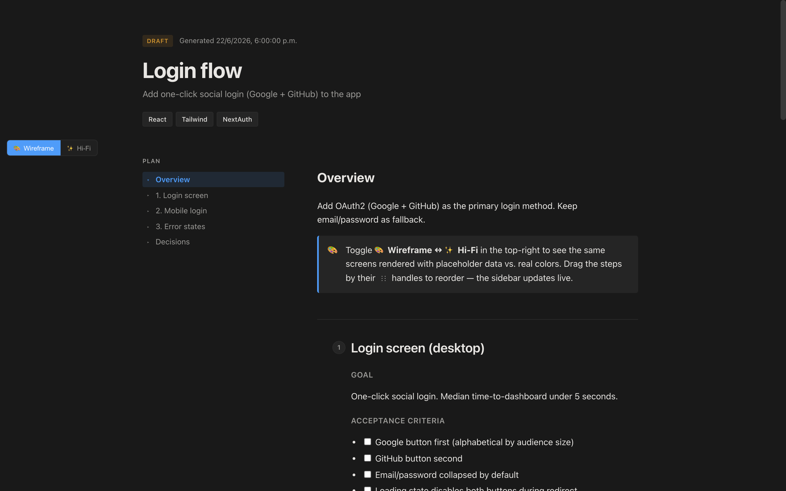
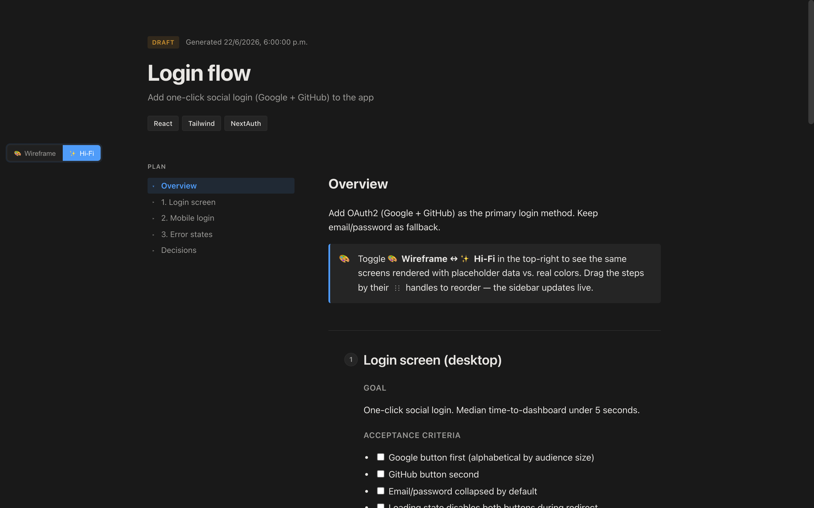
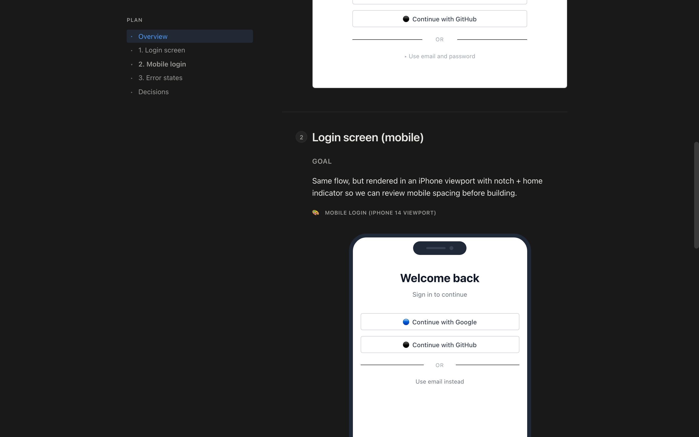
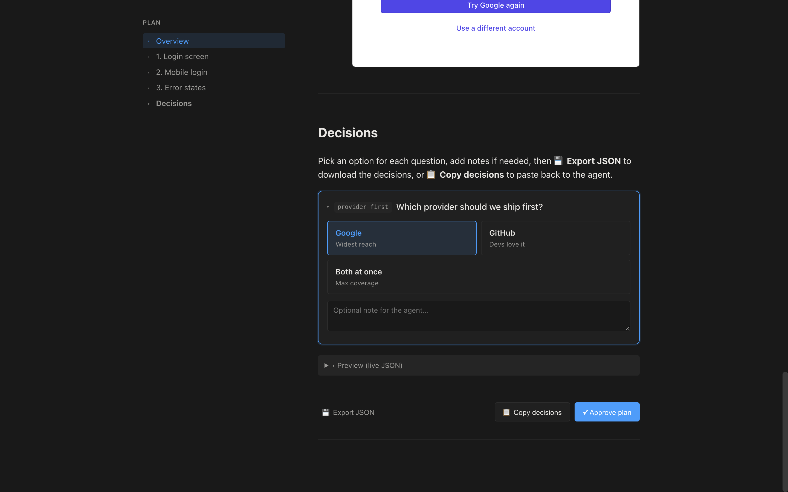
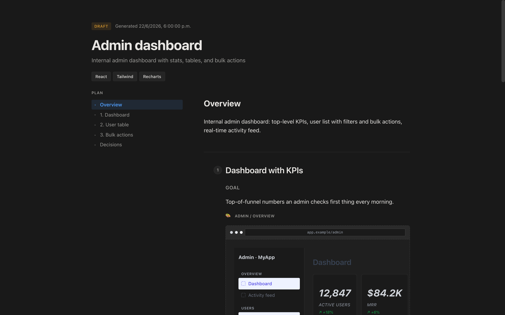

# dynamic-plan

> **Generate interactive implementation plans with Figkit-style wireframes, Mermaid diagrams, and decision forms — directly inside your AI coding agent.**

A skill and slash command (`/dynamic-plan <goal>`) for **Claude Code**, **Codex**, **OpenCode**, **Hermes**, and **Pi** that produces a self-contained `.mdx` plan you can explore visually in the browser.

```
/dynamic-plan Add Google and GitHub OAuth to the TeamX dashboard
```

The agent generates a real HTML wireframe you can review, makes decisions through a form, copies the answers back, and starts implementing with your choices.



### v1.2.0 in action — toggle, mobile, drag, export

The same plan rendered four ways: wireframe ↔ hi-fi, desktop ↔ mobile, with the new export-JSON button at the bottom of every decisions section.

| Wireframe mode (default) | Hi-Fi mode (real colors) |
|---|---|
|  |  |

| Mobile preset (iPhone-shaped) | Decisions + Export JSON |
|---|---|
|  |  |

Drag-to-reorder: every step has a functional `⋮⋮` handle — drag one onto another to swap, the sidebar updates live, and the new order persists per plan.

Plugin API: see [`docs/plugin-api.md`](docs/plugin-api.md) for the full contract.

## Why

Plans in `.md` files are read once and forgotten. Plans in Figma require context-switching. **dynamic-plan** lives where you already work — the AI agent — and produces a single, self-contained, interactive document you can:

- ✅ **Visually review** with real Figkit-style wireframes (not abstract boxes)
- ✅ **Walk through** with a sticky sidebar and progress bar
- ✅ **Make decisions** through radio cards and text fields
- ✅ **Copy back** to the agent to trigger implementation

The output is a standalone `.html` file you can commit, share, archive, or open on any machine with a browser.

## Demo

A 4-step OAuth implementation plan with 9 wireframes, 4 stat cards, 1 bar chart, 1 table, 1 modal, 3 decisions, and a copy-back form — all generated from one `/dynamic-plan` invocation:



## Quick Start

### 1. Install (one time)

```bash
# via npx (recommended)
npx dynamic-plan install

# or manually
git clone https://github.com/teamx-agency/dynamic-plan.git
cd dynamic-plan
bash install.sh
```

> **First-time setup for maintainers:** see [`scripts/first-publish.sh`](scripts/first-publish.sh) for the bootstrap from a fresh repo to a published v1.1.0 release.

The installer detects your platform and copies the skill to all of:
- `~/.claude/skills/dynamic-plan/` + `~/.claude/commands/dynamic-plan.md` (Claude Code)
- `~/.codex/skills/dynamic-plan/` + `~/.codex/commands/dynamic-plan.md` (Codex)
- `~/.hermes/skills/dynamic-plan/` + `~/.hermes/commands/dynamic-plan.md` (Hermes)
- `~/.config/opencode/command/dynamic-plan.md` (OpenCode, auto-loads skills from `~/.agents/skills/`)
- `~/.pi/agent/skills/dynamic-plan/` (Pi)

Verify:

```bash
npx dynamic-plan info
```

### 2. Use it

In any of the supported agents, type:

```
/dynamic-plan <your goal here>
```

Examples:

```
/dynamic-plan Migrate the dashboard from Vue 2 to Vue 3
/dynamic-plan Add a CSV bulk import feature with progress tracking
/dynamic-plan Refactor the auth middleware to support SSO
```

The agent will:

1. Parse your goal and detect the stack (PHP, Python, TS, etc.)
2. Generate a `.mdx` plan in `.dynamic-plan/<slug>-<timestamp>/plan.mdx`
3. Compile it to a self-contained `.html`
4. Spin up a local server on `http://127.0.0.1:8765/`
5. Open the browser to the wireframes

### 3. Review and decide

In the browser, you can:

- Read each step with its goal, why, and acceptance criteria
- Inspect wireframes of the proposed UI (login, settings, modals, etc.)
- Check off acceptance criteria as you confirm them
- Pick options in the **Decisions** section at the bottom
- Click **📋 Copy decisions** to get a paste-ready block

### 4. Hand back to the agent

Paste the copied block into the chat. The agent parses your decisions, confirms, and starts implementing step by step.

## CLI

```bash
npx dynamic-plan <command> [options]

Commands:
  install                   Install the skill for all supported platforms
  uninstall                 Remove from all platforms
  compile <in.mdx> <out>    Compile a .mdx to standalone .html
  serve <dir> [port]        Serve a compiled plan (default port 8765)
  info                      Show install paths and detected platforms
  changelog                 Generate or update CHANGELOG.md from git history
  release <level> [msg]     Bump version, update CHANGELOG, commit + tag
  version                   Print the version
  help                      Show usage
```

If you have the repo cloned locally, you can also call the scripts directly:

```bash
node scripts/compile-mdx.mjs my-plan.mdx my-plan.html
bash scripts/serve-mpx.sh ./my-plan-dir
```

## Writing Plans by Hand

If you want to author `.mdx` plans without the agent, here's a minimal example:

```mdx
---
title: "Login screen"
slug: "login"
generatedAt: "2026-06-23T00:00:00Z"
goal: "Sign in with one click"
status: draft
stack: ["React", "Tailwind"]
---

import {
  PlanHeader, PlanSidebar, PlanStep,
  Screen, ScreenFrame, Button, Field, Input,
  DecisionForm, Decision, CopyDecisions, Callout
} from "./components.js";

<PlanHeader />

<div className="plan-grid">
  <aside className="plan-sidebar">
    <PlanSidebar steps={[
      { id: "overview", title: "Overview" },
      { id: "step-1", title: "1. Login screen" },
      { id: "decisions", title: "Decisions" },
    ]} />
  </aside>

  <main className="plan-main">
    <section id="overview" className="plan-card">
      <h2>Overview</h2>
      <Callout emoji="🎨" tone="info">
        This plan uses real HTML wireframes — not diagrams.
      </Callout>
    </section>

    <PlanStep n={1} title="Login screen">
      <h4>Goal</h4>
      <p>One-click social login.</p>

      <ScreenFrame title="Login" desc="Centered card, 360px wide">
        <Screen title="Login" url="app.example/login">
          <div style={{ maxWidth: 360, margin: "32px auto" }}>
            <h1>Welcome back</h1>
            <Button variant="social">🔵 Continue with Google</Button>
            <Button variant="social">⚫ Continue with GitHub</Button>
          </div>
        </Screen>
      </ScreenFrame>
    </PlanStep>

    <section id="decisions" className="plan-card">
      <h2>Decisions</h2>
      <DecisionForm id="d">
        <Decision id="provider" question="Which provider first?" default="google"
          options={[
            { value: "google", label: "Google" },
            { value: "github", label: "GitHub" },
          ]} />
      </DecisionForm>
      <CopyDecisions target="#d" />
    </section>
  </main>
</div>
```

Compile and serve:

```bash
npx dynamic-plan compile my-plan.mdx my-plan.html
npx dynamic-plan serve ./
```

See [`assets/examples/`](assets/examples/) for 3 complete reference plans.

## Architecture

```
┌────────────────────────────────────────────────────┐
│  AI agent (Claude/Codex/OpenCode/Hermes/Pi)        │
│                                                    │
│  /dynamic-plan <goal>                              │
│       ↓                                            │
│  SKILL.md (skill spec)  →  agent writes plan.mdx   │
│                                                    │
└─────────────────────┬──────────────────────────────┘
                      ↓
┌────────────────────────────────────────────────────┐
│  compile-mdx.mjs (Node 18+, ESM)                   │
│  @mdx-js/mdx → ESM program → standalone .html      │
│  Inlines components.js, style.css, frontmatter     │
│  Output: opens with file:// or any HTTP server     │
└─────────────────────┬──────────────────────────────┘
                      ↓
┌────────────────────────────────────────────────────┐
│  Browser (no build step)                           │
│  • React 18 ESM from esm.sh                        │
│  • Mermaid 10 from jsDelivr                        │
│  • localStorage for progress + decisions           │
│  • prefers-color-scheme: dark/light                │
└────────────────────────────────────────────────────┘
```

**Stack:**
- **MDX 3** — JSX in markdown, compiled to ESM
- **React 18** — rendered client-side via esm.sh (no bundler)
- **Mermaid 10** — backend/data-flow diagrams
- **CSS variables** — Notion-style light/dark theming
- **30+ wireframe components** — `<Screen>`, `<Button>`, `<Modal>`, `<Table>`, `<Stat>`, etc.

See [`docs/architecture.md`](docs/architecture.md) for the full design.

## Cross-Platform Notes

| Platform | Install method | Slash command |
|----------|----------------|---------------|
| macOS    | `npx dynamic-plan install` | `/dynamic-plan` |
| Linux    | `npx dynamic-plan install` | `/dynamic-plan` |
| WSL      | `npx dynamic-plan install` | `/dynamic-plan` |
| Windows (native) | ❌ Use WSL | — |

All skill files use `~`-relative paths so they work the same on every Unix.

**Requirements:**
- Node.js ≥ 18 (for `@mdx-js/mdx` ESM)
- A modern browser (Chrome, Edge, Firefox, Safari)
- Python 3 (only for the local `serve` command, optional)

## Uninstall

```bash
npx dynamic-plan uninstall
# or
bash install.sh --uninstall
```

This removes the skill from all supported platforms without touching your other skills or files.

## Components

### Core (planning structure)

`<PlanHeader>`, `<PlanSidebar>`, `<PlanStep>`, `<ProgressBar>`, `<Mermaid>`, `<Callout>`, `<DecisionForm>`, `<Decision>`, `<CopyDecisions>`

### Wireframes (Figkit-style HTML)

`<Screen>`, `<ScreenFrame>`, `<TopNav>`, `<SideNav>`, `<Layout>`, `<Breadcrumb>`, `<Tabs>`, `<Button>`, `<Field>`, `<Input>`, `<Select>`, `<Textarea>`, `<Checkbox>`, `<Radio>`, `<Toggle>`, `<Card>`, `<Modal>`, `<Toast>`, `<ToastStack>`, `<AlertBanner>`, `<Table>`, `<Avatar>`, `<Badge>`, `<Stat>`, `<Divider>`, `<Row>`, `<Col>`, `<Grid>`

Full API: [`references/wireframe-components.md`](references/wireframe-components.md)

## Why .mdx?

- **Single source of truth** — the plan is a regular file you can grep, diff, and version-control.
- **No build step** — compiles to a self-contained `.html` you can `file://` open.
- **Reusable** — the same `.mdx` works in any MDX-aware tool (Docusaurus, Next.js, Astro, etc.) if you ever want to publish it as docs.

## Contributing

Contributions are welcome! See [CONTRIBUTING.md](CONTRIBUTING.md) for the full guide.

Quick version:

1. Fork the repo and create a branch (`git checkout -b feat/my-improvement`).
2. Make your changes in the right place:
   - **New component?** Add to `assets/components.js` + document in `references/wireframe-components.md` + add an example in `assets/examples/`.
   - **New wireframe snippet?** Add to `references/mermaid-snippets.md` (for Mermaid) or `assets/examples/` (for HTML).
   - **Bug in the compiler?** `scripts/compile-mdx.mjs` is self-contained — easy to test with `node scripts/test-compile.mjs`.
3. Run the test suite: `npm test`.
4. Open a PR describing what changed and why. Screenshots of visual changes are **strongly encouraged**.

**Commit messages** follow [Conventional Commits](https://www.conventionalcommits.org/) — the release script reads them to auto-generate `CHANGELOG.md` and bump the version. Examples:

```
feat: add mobile screen preset
fix: handle empty <DecisionForm> gracefully
docs: clarify install steps for WSL
chore(release): publish v1.1.0
feat!: rename <Card> props for v2
```

The `!` and `BREAKING CHANGE:` footer mark breaking changes (major version bump).

## Release process

Maintainers run:

```bash
# pick the right level
bash release.sh patch "fix: handle empty <DecisionForm>"
bash release.sh minor "feat: mobile screen preset"
bash release.sh major "feat!: rename <Card> props for v2"
# or explicit:
bash release.sh 1.2.3 "feat: ..."
```

What it does:

1. Bumps `package.json`
2. Runs `scripts/changelog.mjs --write` to update `CHANGELOG.md` from conventional commits
3. Commits + tags + pushes

Then the **GitHub Actions release workflow** (`.github/workflows/release.yml`) takes over:

1. Re-runs the test suite
2. Verifies the version matches
3. `npm pack --dry-run` confirms `.npmignore` is correct
4. Publishes to **npm** with provenance
5. Creates a **GitHub release** with the changelog section

Required secrets (one-time setup in repo settings):

- `NPM_TOKEN` — generate from npmjs.com → Access Tokens → Publish
- `GITHUB_TOKEN` — automatically provided by GitHub Actions

## Roadmap

- [x] Toggle "wireframe ↔ high-fidelity" view (real colors on demand) — added in 1.2.0
- [x] Mobile-first preset for the `<Screen>` frame — added in 1.2.0 (`device="mobile"`)
- [x] Drag-to-reorder steps (the `⋮⋮` handles are functional now) — added in 1.2.0
- [x] Export decisions as `.json` file (not just clipboard) — added in 1.2.0
- [x] Plugin API for adding your own wireframe components — added in 1.2.0 (see `docs/plugin-api.md`)
- [x] Persistent per-step notes with markdown preview — added in 1.3.0

## License

MIT © [rod / TeamX Agency](https://github.com/teamx-agency)

## Credits

- Inspired by [Tiptap's Notion-like editor](https://tiptap.dev/docs/ui-components/templates/notion-like-editor) for the visual rhythm
- Inspired by the [Wireframe Design System on UX Design.cc](https://uxdesign.cc/a-wireframe-design-system-dc6f8625aa57) for the placeholder vocabulary
- Built by the TeamX Agency AI team
