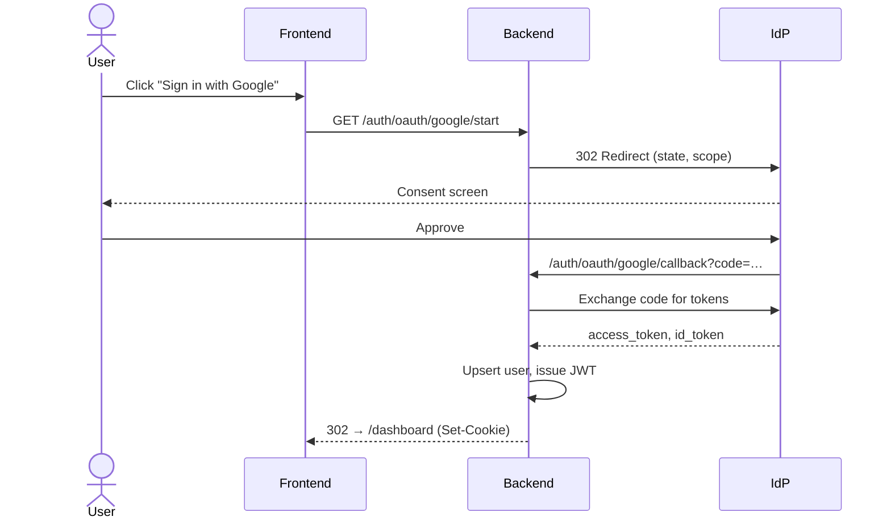
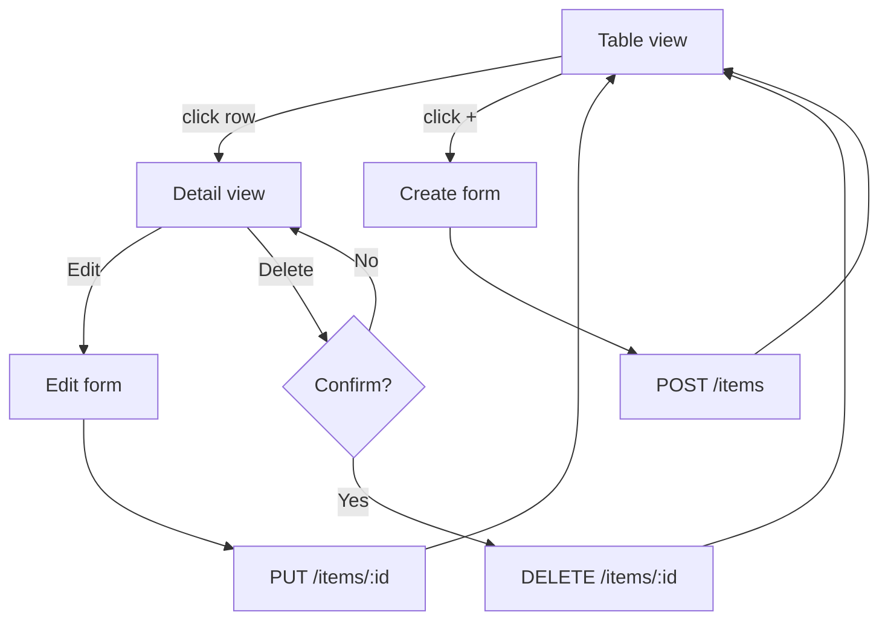
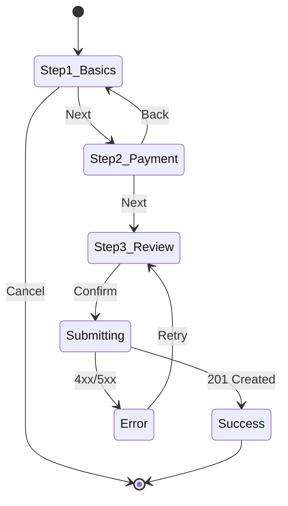
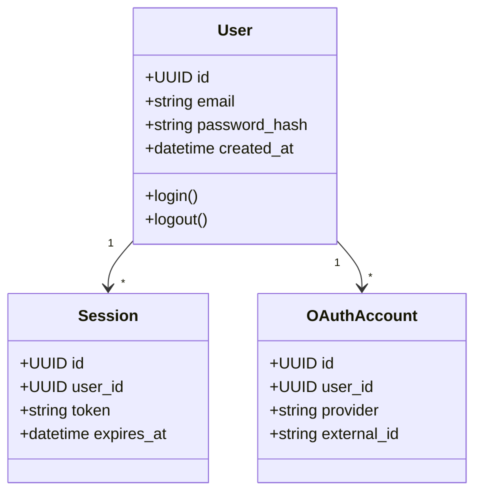
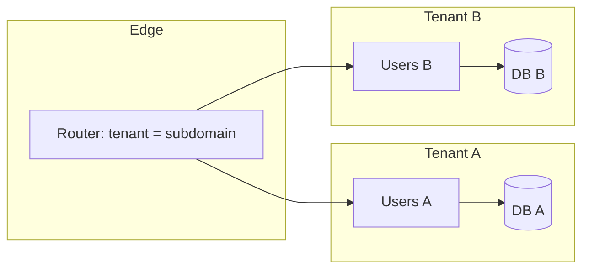
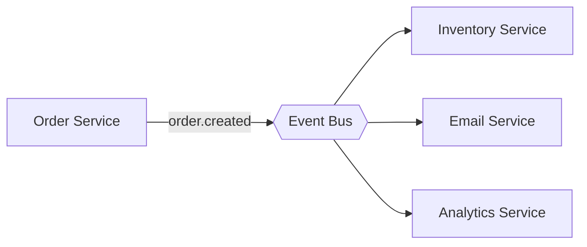
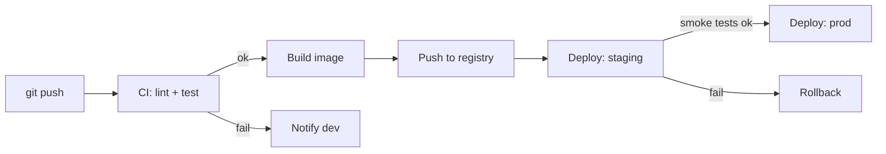
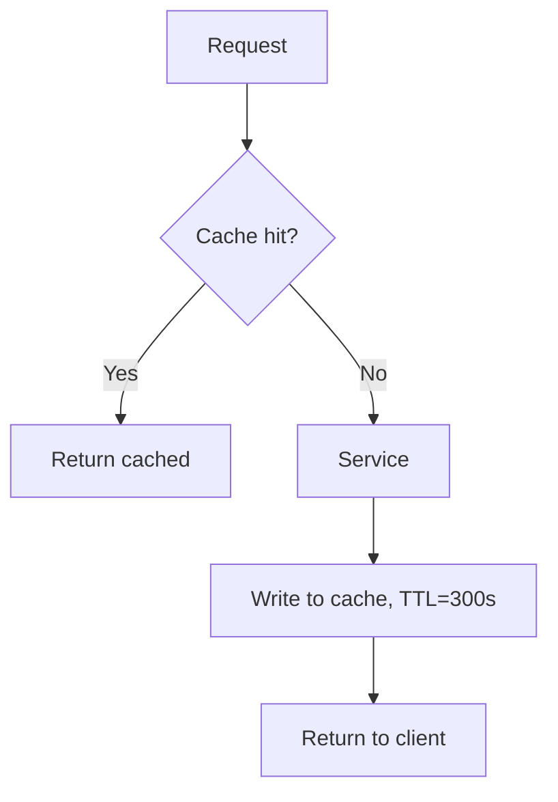
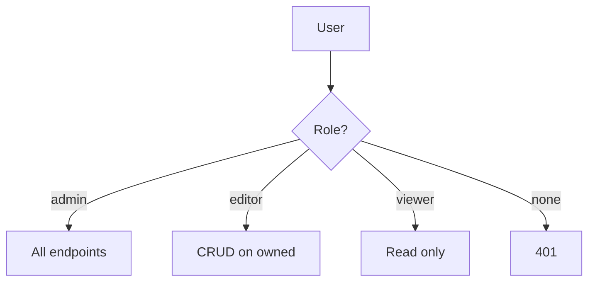
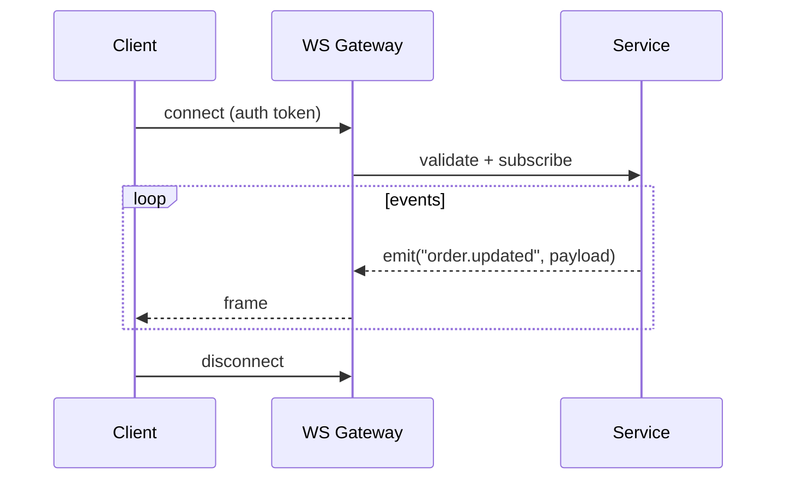

# Mermaid Wireframe Snippets

Ready-to-paste Mermaid diagrams organized by use case. Drop them inside
`<Mermaid chart="..." code={`...`} />`.

## 1. Login / Auth flow

## 2. CRUD list + detail

## 3. Multi-step wizard

## 4. Data model (class diagram)

## 5. Multi-tenant isolation

## 6. Event-driven (publish/subscribe)

## 7. CI/CD pipeline

## 8. Caching strategy

## 9. Role-based access

## 10. WebSocket realtime

## Conventions

- Use `flowchart TD` for top-down control flow.
- Use `sequenceDiagram` for actor/timeline flows.
- Use `stateDiagram-v2` for wizards / finite state.
- Use `classDiagram` for ER-style data models.
- Use `erDiagram` (Mermaid-native) for DB schemas when cardinality matters.
- Keep labels ≤ 6 words. Break long flows into multiple linked diagrams.