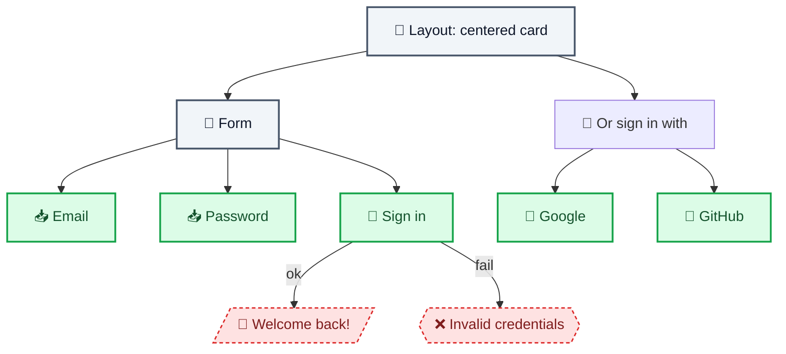
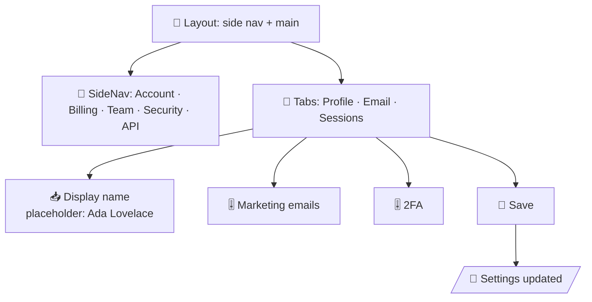
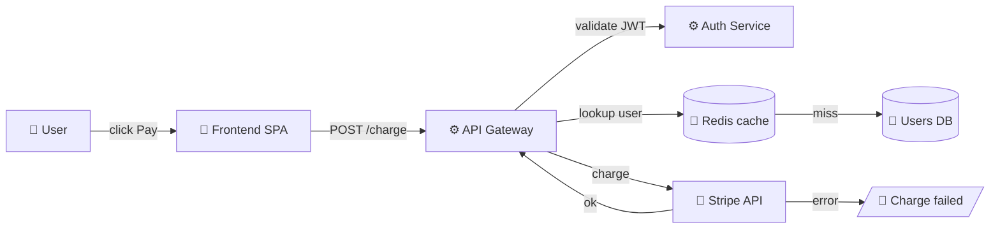
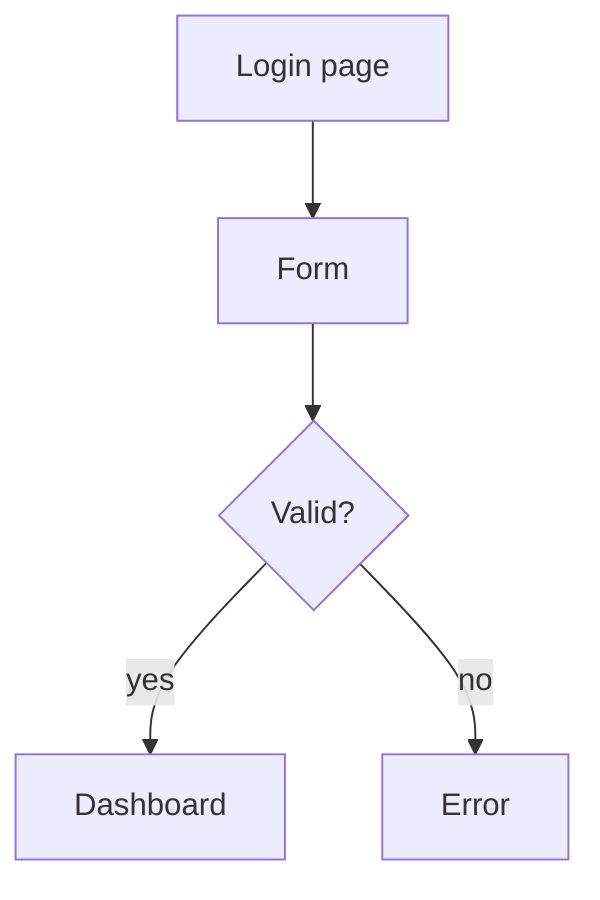
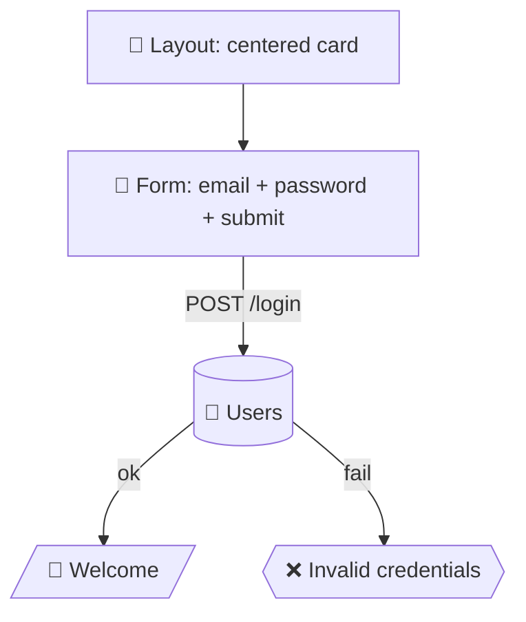

# Wireframe Design System

A vocabulary of UI building blocks for plan wireframes. Each block is a **Mermaid node with an emoji prefix** that maps to a visual category. Use these instead of abstract `flowchart TD` boxes so every plan reads the same — and reviewers immediately know what each shape means.

## Categories & Classdefs

These are auto-applied when you use `<Wireframe>` (the wrapper component). If you write raw Mermaid, paste the matching `classDef` block too.

```mermaid
classDef structure    fill:#f1f5f9,stroke:#475569,stroke-width:2px,color:#0f172a
classDef navigation   fill:#eef2ff,stroke:#4f46e5,stroke-width:2px,color:#312e81
classDef content      fill:#fef3c7,stroke:#d97706,stroke-width:2px,color:#78350f
classDef input        fill:#dcfce7,stroke:#16a34a,stroke-width:2px,color:#14532d
classDef feedback     fill:#fee2e2,stroke:#dc2626,stroke-width:1.5px,color:#7f1d1d,stroke-dasharray: 4 3
classDef system       fill:#1e293b,stroke:#0f172a,stroke-width:1px,color:#e2e8f0
classDef decision     fill:#fdf4ff,stroke:#a21caf,stroke-width:2px,color:#581c87
```

## The library (25 blocks)

### 🏗️ Structure (page chrome)

| Emoji | Name | Mermaid syntax | When to use |
|---|---|---|---|
| 📐 | `Layout` | `Layout["📐 Layout: 2-col 280px sidebar + main"]` | Top-level page structure |
| 🧱 | `Section` | `Section["🧱 Section: hero + 3 cards"]` | Major page area |
| 🪟 | `Modal` | `Modal{{"🪟 Modal: Confirm delete?\n[Cancel] [Delete]"}}` | Overlays, dialogs |
| 🗂️ | `Drawer` | `Drawer[/"🗂️ Drawer: slide-in from right"/]` | Side panels, sheets |
| 📦 | `Card` | `Card["📦 Card: title + body + CTA"]` | Self-contained content block |

### 🧭 Navigation (wayfinding)

| Emoji | Name | Mermaid syntax | When to use |
|---|---|---|---|
| 🧭 | `TopNav` | `TopNav["🧭 TopNav: logo · Products · Pricing · Docs · Sign in · CTA"]` | Global header |
| 📂 | `SideNav` | `SideNav["📂 SideNav: collapsible tree, 3 levels"]` | App-internal navigation |
| 🍞 | `Breadcrumb` | `Breadcrumb["🍞 Home / Docs / API / Auth"]` | Current location |
| 🔗 | `Tabs` | `Tabs["🔗 Tabs: Overview · Logs · Settings"]` | Switch view in same context |
| 📍 | `Stepper` | `Stepper["📍 ① Basics → ② Payment → ③ Review"]` | Multi-step wizard |

### 📄 Content (what the user reads)

| Emoji | Name | Mermaid syntax | When to use |
|---|---|---|---|
| 📄 | `Page` | `Page["📄 Page: marketing copy + CTA"]` | Full page |
| 📝 | `Form` | `Form["📝 Form: 4 fields + submit"]` | Data entry screen |
| 📊 | `Table` | `Table["📊 Table: sortable cols, pagination"]` | List/grid of records |
| 🖼️ | `Media` | `Media["🖼️ Media: hero image + caption"]` | Image/video block |
| 📋 | `List` | `List["📋 List: 5 items, check-off"]` | Simple list |

### ⌨️ Input (user actions)

| Emoji | Name | Mermaid syntax | When to use |
|---|---|---|---|
| 🔘 | `Button` | `Btn["🔘 [Primary CTA: Save]"]` | Any button |
| 🔘 | `IconBtn` | `IconBtn["🔘 ⓘ (icon-only, tooltip)"]` | Compact icon button |
| 📥 | `Field` | `Field["📥 Email input\nplaceholder: you@co.com"]` | Text input |
| ☑️ | `Checkbox` | `Check["☑️ Remember me"]` | Boolean input |
| 🔘 | `Radio` | `Radio(("🔘 ○ Plan · ○ Team · ● Pro"))` | Single-choice |
| 🎚️ | `Toggle` | `Toggle["🎚️ Notifications: ON"]` | On/off switch |
| 🔽 | `Select` | `Select["🔽 Status: [Active ▾]"]` | Dropdown |

### 🔔 Feedback (system speaking)

| Emoji | Name | Mermaid syntax | When to use |
|---|---|---|---|
| 🔔 | `Toast` | `Toast[/"🔔 Toast: Saved ✓ (3s auto-dismiss)"/]` | Transient notification |
| ⚠️ | `Alert` | `Alert{{"⚠️ Warning: 3 retries left"}}` | Inline alert / banner |
| ❌ | `Error` | `Err{{"❌ 500 — Something went wrong"}}` | Error state |
| 🟢 | `Success` | `OK{{"🟢 Payment received"}}` | Success state |
| ⏳ | `Loading` | `Load{{"⏳ Loading… (skeleton)"}}` | In-progress state |

### ⚙️ System (behind the scenes)

| Emoji | Name | Mermaid syntax | When to use |
|---|---|---|---|
| ⚙️ | `Service` | `Svc["⚙️ API Gateway"]` | Backend service |
| 💾 | `Database` | `DB[("💾 Postgres\nprimary")] | Database / store |
| 🔌 | `External` | `Ext["🔌 Stripe API"]` | Third-party dependency |
| 🔀 | `Router` | `Rtr{{"🔀 /auth/* → OAuthSvc"}}` | Routing decision |
| 🔐 | `AuthGate` | `Gate{{"🔐 Auth required"}}` | Auth check |

## Drop-in examples

### Example 1: Login screen



### Example 2: Settings page



### Example 3: Backend data flow



## Using `<Wireframe>` in .mdx

The `<Wireframe>` wrapper component auto-applies all classDefs and adds an
"abstract / wireframe" toggle so reviewers can switch between detailed and
high-level views.

```mdx
<Wireframe code={`flowchart TD
  Login["📐 Layout: centered card"]
  Form["📝 Form: email + password + submit"]
  Toast[/"🔔 Welcome!"/]
  Login --> Form --> Toast
`} />
```

Or pass an existing Mermaid diagram (with or without classDef) — `<Wireframe>`
will fill in missing classes.

## Conventions

- One block = one user-visible thing. Don't cram "modal with form and toast inside".
- Use `flowchart LR` for horizontal flows (mobile, wizards), `flowchart TD` for vertical (most web pages).
- Service/db/external nodes don't need emoji prefix if you wrap them in a `subgraph Backend`.
- Keep labels ≤ 8 words. If you need more, split into multiple blocks.
- Always include at least one feedback block (toast / error / alert) on flows longer than 3 steps — reviewers want to see failure modes.

## Migration from generic Mermaid

Old:


New:
